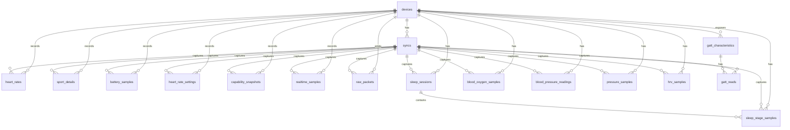

# Database Design

## Purpose

The SQLite database is the local system of record for H59 sync data.

It is designed to support both:
- direct querying for analytics
- future decoder improvements based on preserved raw protocol evidence

## Design Principles

1. Keep device and sync provenance explicit.
2. Store decoded history in simple queryable tables.
3. Preserve raw packets and GATT snapshots for future reverse-engineering.
4. Keep timestamp storage unambiguous and UTC-only.

## Timestamp Policy

SQLite does not have a native timezone-aware timestamp type.

This project therefore uses:
- ISO-8601 `TEXT` timestamps
- explicit `+00:00` UTC offsets
- application-side normalization to UTC before insert
- `database_metadata.timestamp_timezone = UTC`

Practical consequence:
- all stored timestamps are UTC
- local-day rendering must be done in the analytics or dashboard layer

## Core Tables

- `devices`
- `syncs`
- `heart_rates`
- `sport_details`

## Supporting Tables

- `database_metadata`
- `battery_samples`
- `heart_rate_settings`
- `capability_snapshots`
- `realtime_samples`
- `gatt_characteristics`
- `gatt_reads`
- `raw_packets`
- `sleep_sessions`
- `sleep_stage_samples`
- `blood_oxygen_samples`
- `blood_pressure_readings`
- `pressure_samples`
- `hrv_samples`

## Mermaid ER Diagram

## Table Roles

### `devices`

One row per wearable device.

Key fields:
- `device_id`
- `address`
- `nickname`
- `name`
- `hw_version`
- `fw_version`
- `advertisement_json`
- `last_seen_at`

Notes:
- `nickname` is optional
- if set, it must be unique across all devices

### `syncs`

One row per acquisition run.

Key fields:
- `sync_id`
- `device_id`
- `timestamp`
- `finished_at`
- `source`
- `comment`

### `heart_rates`

Historical heart-rate samples decoded from the bracelet.

### `sport_details`

Historical activity bins decoded from the bracelet.

### `sleep_sessions`

Decoded nightly sleep sessions.

Key fields:
- `start_timestamp`
- `end_timestamp`
- `total_minutes`
- `is_provisional`
- `raw_json`

### `sleep_stage_samples`

Decoded sleep stage periods linked to a session.

Key fields:
- `sleep_session_id`
- `sequence_index`
- `stage`
- `start_timestamp`
- `end_timestamp`
- `minutes`
- `is_provisional`

### `blood_oxygen_samples`

Historical SpO2 min/max sample pairs.

Current note:
- timing/header semantics are still provisional

### `blood_pressure_readings`

Paired systolic/diastolic blood-pressure readings.

Current note:
- the table exists as the correct local model for BP
- the extraction path on this H59 is still under investigation

### `pressure_samples`

Historical pressure or stress-like score samples.

### `hrv_samples`

Historical HRV-like samples.

### `raw_packets`

Every captured protocol packet, for replay and future decoding.

## Indexing and Deduplication

Current uniqueness rules:
- `devices.address`
- `devices.nickname` when not null
- `heart_rates(device_id, timestamp)`
- `sport_details(device_id, timestamp)`
- `gatt_characteristics(device_id, char_uuid, handle)`
- `sleep_sessions(device_id, source_command, raw_json)`
- `sleep_stage_samples(sleep_session_id, sequence_index)`
- `blood_oxygen_samples(device_id, timestamp, source_command)`
- `blood_pressure_readings(device_id, timestamp, source_command)`
- `pressure_samples(device_id, timestamp, source_command)`
- `hrv_samples(device_id, timestamp, source_command)`

This supports:
- incremental sync overlap
- idempotent re-sync of already-seen days
- provisional parser upgrades without losing raw evidence

## Compatibility Mapping

The external reverse-engineering base used earlier is documented separately in
[Compatibility Mapping](/Users/remi.turpaud/Code/h59/docs/research/compatibility_mapping.md:1).
