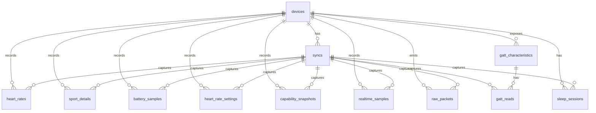

# Database Design

## Purpose

The SQLite database is the local system of record for H59 sync data.

It is designed to support both:
- direct querying for analytics
- future decoder improvements based on preserved raw protocol evidence

## Design Principles

1. Keep device and sync provenance explicit.
2. Store decoded history in simple queryable tables.
3. Preserve raw packets and GATT snapshots for future reverse-engineering.
4. Make room for sleep and additional health metrics as first-class tables.

## Core Tables

- `devices`
- `syncs`
- `heart_rates`
- `sport_details`

## Supporting Tables

- `battery_samples`
- `heart_rate_settings`
- `capability_snapshots`
- `realtime_samples`
- `gatt_characteristics`
- `gatt_reads`
- `raw_packets`
- `sleep_sessions`

## Mermaid ER Diagram

## Table Roles

### `devices`

One row per wearable device.

Key fields:
- `device_id`
- `address`
- `name`
- `hw_version`
- `fw_version`
- `advertisement_json`
- `last_seen_at`

### `syncs`

One row per acquisition run.

Key fields:
- `sync_id`
- `device_id`
- `timestamp`
- `finished_at`
- `source`
- `comment`

### `heart_rates`

Historical heart-rate samples decoded from the bracelet.

Key fields:
- `timestamp`
- `reading`
- `device_id`
- `sync_id`
- `source_command`
- `raw_packet_hex`

### `sport_details`

Historical activity bins decoded from the bracelet.

Key fields:
- `timestamp`
- `time_index`
- `steps`
- `distance`
- `calories`
- `device_id`
- `sync_id`
- `source_command`
- `raw_packet_hex`

### `raw_packets`

Every captured protocol packet, for replay and future decoding.

Key fields:
- `timestamp`
- `direction`
- `channel_uuid`
- `command_id`
- `packet_hex`
- `device_id`
- `sync_id`

### `sleep_sessions`

Reserved for decoded sleep summaries.

Current status:
- schema exists
- decoder is still under active implementation

## Indexing and Deduplication

Current uniqueness rules:
- `devices.address`
- `heart_rates(device_id, timestamp)`
- `sport_details(device_id, timestamp)`
- `gatt_characteristics(device_id, char_uuid, handle)`

This supports:
- incremental sync overlap
- idempotent re-sync of already-seen days

## Compatibility Mapping

The external reverse-engineering base used earlier is documented separately in
[Compatibility Mapping](/Users/remi.turpaud/Code/h59/docs/research/compatibility_mapping.md:1).
